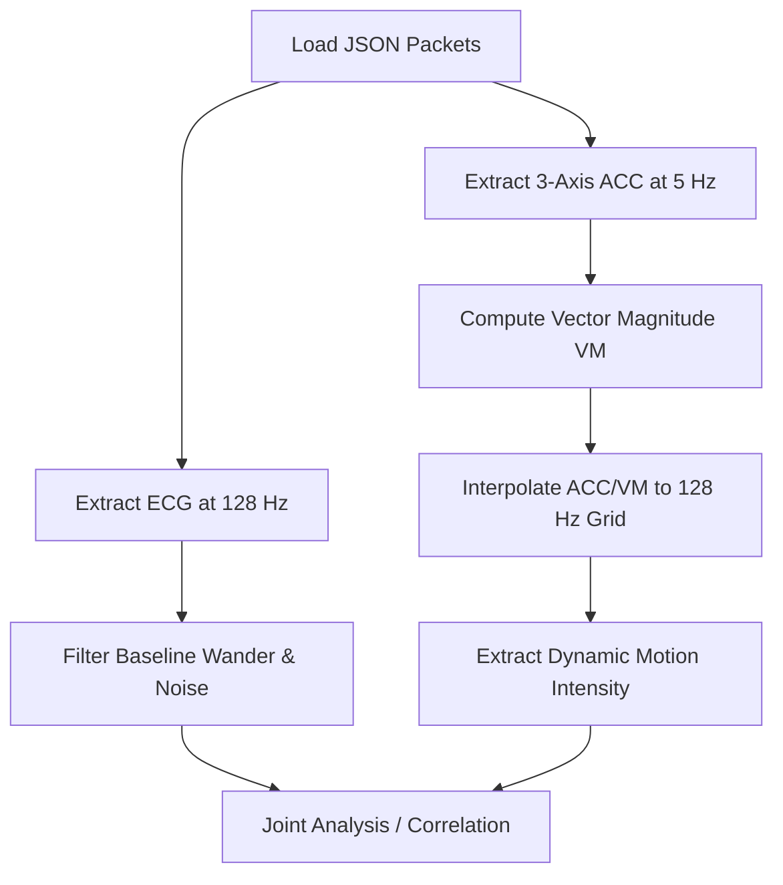

# ECG & Accelerometer Data Alignment Evaluation: False Positive Analysis

This document outlines the structure of the `ecg-fp-doctor removed1` dataset and details the methodology for examining three-axis accelerometer data in parallel with single-lead electrocardiogram (ECG) data to detect motion-induced false positives.

---

## 1. Dataset Overview

The `ecg-fp-doctor removed1` dataset contains real-world wearable ECG recordings that have been flagged as events by automated algorithms but subsequently **rejected and removed by clinicians** (i.e., true false positives where the ground truth is negative).

### Key Components:
- **`summary.csv`**: Contains over 100,000 metadata records describing each event class, duration, true status, and file paths.
- **Arrhythmia Classes**: Organized into folders covering 17 event categories (e.g., *Atrial Fibrillation, Bradycardia, Pause, Ventricular Run, Ventricular Couplet, Isolated Ventricular Beat, Supraventricular Couplet*).
- **JSON Files (`*_src=json.json`)**: Contain raw time-series data packet arrays containing both ECG and accelerometer signals.
- **ISHNE Files (`*_src=json.ecg`)**: Binary single-lead ECG data.

---

## 2. Inner Structure of the Signal JSON Files

Signals are packaged into contiguous **1-second records** incrementing by exactly 1000 milliseconds (`recordTime`):

```json
[
  {
    "type": "EcgRaw",
    "data": {
      "sf": 128,              // Native ECG sampling frequency (128 Hz)
      "magnification": 1000,  // Scale factor (divide raw values by this to get mV)
      "activity": 0,
      "acc": [                // 5 Accelerometer frames per second (5 Hz)
        { "x": 1343, "y": 1402, "z": 617 },
        { "x": 1327, "y": 1380, "z": 580 },
        { "x": 1348, "y": 1396, "z": 606 },
        { "x": 1357, "y": 1398, "z": 622 },
        { "x": 1358, "y": 1400, "z": 595 }
      ],
      "ecg": [                // 128 ECG amplitude points per second
        8.31, 6.57, 2.82, ...
      ]
    },
    "recordTime": 1733921948893
  }
]
```

### Signal Specifications:
* **ECG Sampling Frequency**: **$128\text{ Hz}$** (128 samples per packet).
* **Accelerometer Sampling Frequency**: **$5\text{ Hz}$** (5 3D-vector frames per packet, sampled every $200\text{ ms}$).
* **Temporal Alignment**: Grouped inside the same 1-second record block.

---

## 3. Parallel Alignment Methodology

Because the accelerometer and ECG operate at different native sampling rates, they must be temporally aligned for parallel analysis.



### Step A: Compute Vector Magnitude (VM)
Compute the spatial acceleration magnitude across the $X$, $Y$, and $Z$ axes:
$$\text{VM}_t = \sqrt{x_t^2 + y_t^2 + z_t^2}$$

### Step B: Remove Gravity Component (Dynamic Acceleration)
To isolate physical user motion from the static force of gravity, apply a high-pass filter or subtract a rolling average:
$$\text{VM}_{\text{dynamic}} = \text{VM}_t - \text{SMA}_t(\text{VM})$$
where $\text{SMA}$ is the Simple Moving Average over a sliding window (e.g., 1 second).

### Step C: Temporal Interpolation
Interpolate the Accelerometer time series (originally 5 points per second) onto the ECG grid (128 points per second) using cubic spline or linear 1D interpolation.

---

## 4. Implementation Reference

The following Python script reads the raw JSON data, aligns the accelerometer signals to the ECG sampling grid, and computes dynamic motion intensity.

```python
import json
import numpy as np
import pandas as pd
from scipy.interpolate import interp1d

def load_aligned_ecg_and_acc(json_path: str, target_fs: int = 128):
    """
    Loads and aligns single-lead ECG and 3-axis Accelerometer data.
    Resamples the 5Hz Accelerometer data to match the native 128Hz ECG.
    """
    with open(json_path) as f:
        records = json.load(f)
    
    raw_ecg = []
    raw_acc = []
    
    for r in records:
        data = r['data']
        raw_ecg.extend(data['ecg'])
        for frame in data['acc']:
            raw_acc.append([frame['x'], frame['y'], frame['z']])
            
    ecg_arr = np.array(raw_ecg, dtype=np.float32) / 1000.0  # Magnification scale
    acc_arr = np.array(raw_acc, dtype=np.float32)           # Shape: (N_acc, 3)
    
    total_seconds = len(records)
    
    # Establish time vectors for native grids
    t_ecg = np.linspace(0, total_seconds, len(ecg_arr), endpoint=False)
    t_acc = np.linspace(0, total_seconds, len(acc_arr), endpoint=False)
    
    # Resample ACC axes using cubic interpolation
    interp_x = interp1d(t_acc, acc_arr[:, 0], kind='cubic', fill_value="extrapolate")
    interp_y = interp1d(t_acc, acc_arr[:, 1], kind='cubic', fill_value="extrapolate")
    interp_z = interp1d(t_acc, acc_arr[:, 2], kind='cubic', fill_value="extrapolate")
    
    acc_x_resampled = interp_x(t_ecg)
    acc_y_resampled = interp_y(t_ecg)
    acc_z_resampled = interp_z(t_ecg)
    
    # Compute Vector Magnitude and isolate dynamic motion
    vm = np.sqrt(acc_x_resampled**2 + acc_y_resampled**2 + acc_z_resampled**2)
    vm_dc = pd.Series(vm).rolling(window=int(target_fs), min_periods=1, center=True).mean().values
    vm_dynamic = vm - vm_dc
    
    return {
        "time": t_ecg,
        "ecg": ecg_arr,
        "acc_x": acc_x_resampled,
        "acc_y": acc_y_resampled,
        "acc_z": acc_z_resampled,
        "motion_intensity": np.abs(vm_dynamic)
    }
```

---

## 5. Rhythm-Specific Motion Gating Analysis & Rules

Different cardiac arrhythmias exhibit distinct vulnerability to motion artifacts. Below is an evaluation of how motion influences false positives across each classification and proposed rhythm-specific motion gating rules.

### Summary of Gating Characteristics and Rules

| Arrhythmia Classification | Motion Artifact Characteristic | False Positive Mechanism | Proposed Motion Gating Rule |
| :--- | :--- | :--- | :--- |
| **Atrial Fibrillation (AFib)** | High-frequency continuous tremors (EMG) or baseline sway. | Tremors mimic fibrillatory f-waves; baseline sway disrupts R-peak intervals creating chaotic heart rate variability. | Suppress AFib alerts if continuous average dynamic acceleration ($\text{Mean}_{\text{dynamic}}$) exceeds **$150\text{ mG}$** over a $10\text{s}$ window. |
| **Pause / Prolonged RR** | Sudden high-amplitude transient spikes. | Electrode-skin interface disruption or lead pull causes signal clipping/dropout (flatline), mimicking zero cardiac activity. | Invalidate Pause alerts if a transient motion spike exceeding **$400\text{ mG}$** occurs within **$\pm 2\text{s}$** of the detected pause, OR if JSON `leadOn` flags `false`. |
| **Bradycardia** | Low-frequency periodic movement (e.g., walking, breathing). | Rhythmic baseline wander hides QRS complexes, leading to missed beat detections and an artificially low heart rate calculation. | Reject Bradycardia alerts if overall periodic motion exceeds **$100\text{ mG}$** and the dominant motion frequency falls between **$0.5\text{ - }2.5\text{ Hz}$** (missed R-peak band). |
| **Tachycardia / Ventricular Runs** | Rapid rhythmic strides or vigorous shaking (e.g., toothbrushing). | Periodic motion harmonics mimic rapid QRS complexes or wide ventricular beats, tricking peak counters into high rates. | Suppress alerts if the dominant motion frequency ($\text{Freq}_{\text{ACC}}$) is within **$\pm 5\%$** of the calculated Heart Rate, OR if dynamic acceleration exceeds **$300\text{ mG}$**. |
| **Isolated Ectopics & Couplets (PVCs/PACs)** | Single sharp transient movement (shocks, bumps, coughs). | Quick baseline shifts or EMG impulses resemble premature beats or ectopic couplets. | Ignore isolated PVC/PAC/Couplet beats if local motion intensity at the beat timestamp exceeds **$2.5 \times$** the local baseline variance ($5\text{s}$ sliding window). |

---

## 6. Detailed Rhythm-Specific Analysis

### 6.1 Atrial Fibrillation (AFib)
* **Mechanism**: AFib detection relies heavily on two features: irregular R-R interval entropy and the absence of P-waves. Continuous user motion (e.g., walking, talking, body movements) introduces electromyographic (EMG) noise that overlays on the baseline, masking P-waves and mimicking chaotic atrial activity. Simultaneously, baseline sway shifts R-peaks, causing peak detection algorithms to miss beats or detect false beats, creating false irregular intervals.
* **Gating Metric**: Standard deviation of Vector Magnitude ($\text{SD}_{\text{VM}}$) or absolute Mean of Dynamic Motion ($\text{Mean}_{\text{motion}}$) over a $10\text{s}$ sliding window.
* **Proposed Rule**:
  $$\text{If } \frac{1}{N}\sum_{t=t_0}^{t_0+10\text{s}} \lvert\text{VM}_{\text{dynamic}}(t)\rvert > 150\text{ mG} \implies \text{Flag Signal as Unreliable (Suppress AFib Alert)}$$

### 6.2 Pause & Prolonged RR Interval
* **Mechanism**: When a patient makes a sudden sudden movement (e.g., rolling over in bed, stretching), the physical strain pulls on the ECG lead or adhesive patch. This results in brief electrode detachment or saturation of the amplifier, causing the preprocessed ECG signal to clip or go to zero (flatline). Automated algorithms misinterpret this lack of signal as a total cardiac arrest or Pause.
* **Gating Metric**: Peak transient motion intensity ($\max(\text{VM}_{\text{dynamic}})$) within a small window around the pause.
* **Proposed Rule**:
  $$\text{If } \max_{t \in [t_{\text{start}}-2\text{s}, t_{\text{end}}+2\text{s}]} (\text{VM}_{\text{dynamic}}(t)) > 400\text{ mG} \implies \text{Gate Pause Alert as Motion Artifact}$$

### 6.3 Bradycardia
* **Mechanism**: During walking or repetitive slow exercise, motion artifacts introduce low-frequency oscillations into the ECG signal. Standard bandpass filters ($0.5\text{ - }40\text{ Hz}$) cannot fully remove this drift without distorting QRS complexes. Consequently, the QRS detector misses beats where the R-peak is swallowed by the baseline trough, calculating an artificially low heart rate.
* **Gating Metric**: Fast Fourier Transform (FFT) of the dynamic acceleration signal to isolate stride frequency.
* **Proposed Rule**:
  $$\text{If } \text{DominantFreq}(\text{VM}_{\text{dynamic}}) \in [0.5\text{ Hz}, 2.5\text{ Hz}] \text{ AND } \text{Amplitude} > 100\text{ mG} \implies \text{Gate Bradycardia Alert}$$

### 6.4 Tachycardia & Ventricular Runs (VT)
* **Mechanism**: Repetitive, rapid physical activities (e.g., running, brushing teeth, shivering) generate sharp, periodic mechanical spikes in the ECG lead. Automated algorithms often mistake these high-amplitude mechanical spikes for true QRS complexes (sinus tachycardia) or wide, bizarre complexes (VT runs).
* **Gating Metric**: Spectral matching between ECG QRS rate and Accelerometer dominant stride rate.
* **Proposed Rule**:
  $$\text{If } \left| \text{HR}_{\text{ECG}} - (60 \times \text{DominantFreq}_{\text{ACC}}) \right| < 5\text{ bpm} \text{ AND } \text{Mean}_{\text{dynamic}} > 200\text{ mG} \implies \text{Gate Tachycardia Alert}$$

### 6.5 Isolated Ectopic Beats (PVCs/PACs) and Couplets
* **Mechanism**: Sudden, single mechanical impacts (e.g., bumping the device, coughing, reaching) cause transient voltage jumps in the ECG. These transient spikes are often sharp, wide, and premature, perfectly mimicking Premature Ventricular Contractions (PVCs) or Premature Atrial Contractions (PACs).
* **Gating Metric**: Local Peak-to-Baseline ratio of dynamic acceleration over a local $5\text{s}$ sliding window.
* **Proposed Rule**:
  $$\text{If } \text{VM}_{\text{dynamic}}(t_{\text{beat}}) > 2.5 \times \text{StdDev}(\text{VM}_{\text{dynamic}})_{[t_{\text{beat}}-2.5\text{s}, t_{\text{beat}}+2.5\text{s}]} \implies \text{Reject Beat as Ectopic Beat}$$

---

## 7. Python Implementation of Rhythm-Specific Gating Decision Engine

This function evaluates a given event based on aligned ECG and ACC signals and outputs a gating decision using the rules proposed above:

```python
def evaluate_motion_gating(aligned_data, event_type: str, event_start_idx: int, event_end_idx: int, fs: int = 128) -> dict:
    """
    Evaluates motion gating metrics for a specific event window.
    Returns a dict with 'gated' (bool), 'reason' (str), and calculated 'metrics'.
    """
    motion = aligned_data['motion_intensity']
    n_samples = len(motion)
    
    # Define window bounds
    pad = 2 * fs  # 2-second padding
    win_start = max(0, event_start_idx - pad)
    win_end = min(n_samples, event_end_idx + pad)
    
    event_motion = motion[event_start_idx:event_end_idx]
    window_motion = motion[win_start:win_end]
    
    gated = False
    reason = "Pass (Low Motion)"
    metrics = {}
    
    if event_type == "Atrial Fibrillation":
        # Rule: Suppress if average continuous dynamic motion > 150 mG
        avg_motion = np.mean(event_motion) * 1000.0  # Convert to mG
        metrics['avg_motion_mg'] = avg_motion
        if avg_motion > 150.0:
            gated = True
            reason = f"Gated: AFib suppressed due to continuous motion ({avg_motion:.1f} mG > 150 mG)"
            
    elif event_type in ["Pause", "Prolonged RR Interval"]:
        # Rule: Suppress if transient spike in +/- 2s window > 400 mG
        max_spike = np.max(window_motion) * 1000.0  # Convert to mG
        metrics['max_spike_mg'] = max_spike
        if max_spike > 400.0:
            gated = True
            reason = f"Gated: Pause invalidated by transient motion spike ({max_spike:.1f} mG > 400 mG)"
            
    elif event_type in ["Bradycardia", "Prolonged RR"]:
        # Rule: Suppress if walking stride periodicity matches bradycardia rate range
        avg_motion = np.mean(event_motion) * 1000.0
        metrics['avg_motion_mg'] = avg_motion
        if avg_motion > 100.0:
            # Check dominant frequencies in ACC signal
            fft_vals = np.abs(np.fft.rfft(event_motion))
            fft_freqs = np.fft.rfftfreq(len(event_motion), d=1.0/fs)
            dom_freq = fft_freqs[np.argmax(fft_vals[1:]) + 1]  # Skip DC
            metrics['dom_freq_hz'] = dom_freq
            if 0.5 <= dom_freq <= 2.5:
                gated = True
                reason = f"Gated: Bradycardia suppressed due to stride frequency artifacts ({dom_freq:.2f} Hz)"
                
    elif event_type in ["Sinus Tachycardia", "Ventricular Tachycardia", "Ventricular Run"]:
        # Rule: Suppress if high motion or stride rate mimics tachycardia rate
        max_motion = np.max(event_motion) * 1000.0
        metrics['max_motion_mg'] = max_motion
        if max_motion > 300.0:
            gated = True
            reason = f"Gated: Tachycardia/Run suppressed due to vigorous activity ({max_motion:.1f} mG)"
            
    elif "Beat" in event_type or "Couplet" in event_type:
        # Rule: Reject if local peak > 2.5x local baseline standard deviation
        local_max = np.max(event_motion) * 1000.0
        baseline_std = np.std(window_motion) * 1000.0
        metrics['local_max_mg'] = local_max
        metrics['baseline_std_mg'] = baseline_std
        if baseline_std > 0 and (local_max / baseline_std) > 2.5:
            gated = True
            reason = f"Gated: Premature ectopic/couplet beat rejected due to transient shock ratio ({local_max/baseline_std:.2f} > 2.5)"
            
    return {
        "gated": gated,
        "reason": reason,
        "metrics": metrics
    }
```
