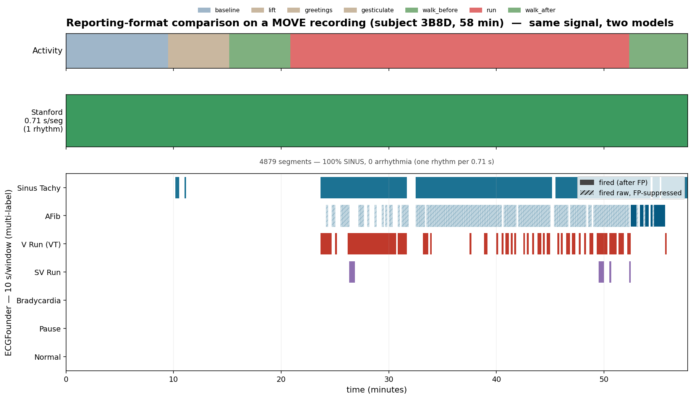
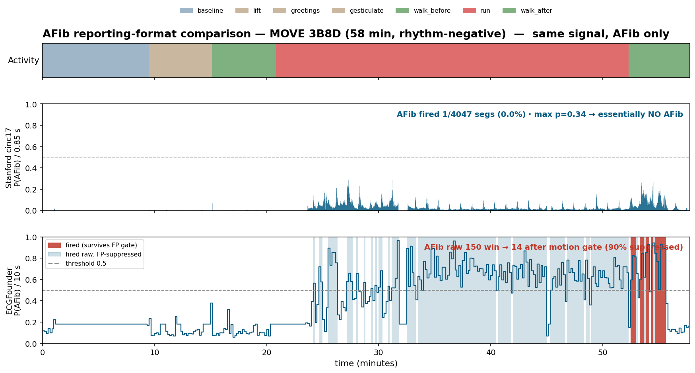

# Stanford vs ECGFounder on a MOVE long recording

**Date**: 2026-05-30
**Recording**: MOVE subject **3B8D**, single-lead chest `ecg:gel`, **57.8 min** (3,470 s).
**Both models run on the same recording.**
**Critical framing**: MOVE has **no ground-truth rhythm labels** (only activity tags), so this is
**not** an accuracy/F1 benchmark. It compares (a) **false-positive behavior on rhythm-negative
ambulatory data** and (b) **reporting format**. MOVE is rhythm-negative, so any *arrhythmia*
detection is effectively a false positive (sinus tachycardia during exercise is the one nuance — see below).

Runners: ECGFounder → `scripts/report_recording.py`; Stanford → `stanford/run_stanford_on_move.py`
(mitdb 1D-ResNet, resampled 500→360 Hz, per-recording z-score). Reports in `res/recording_reports/3B8D*/`.

---

## 1. Performance / behavior on rhythm-negative MOVE

| | **Stanford 1D-ResNet** | **ECGFounder** (base + FP-on, move_chest_gel) |
|---|---|---|
| classes | SINUS / BIGEMINY / TRIGEMINY / VT (4) | 7-label scope (Normal, Brady, AFib, Sinus-Tachy, SV-Run, V-Run, Pause) |
| **SINUS / normal** | **100.0 %** of segments | (Normal head fires 0 — see note) |
| **false arrhythmia** | **0 episodes** (0 % BIGEMINY/TRIGEMINY/VT) | **VT 28.3 %**, AFib 4.9 % (after motion gate; 43 %→4.9 %), SV-Run 2.3 % |
| Sinus tachycardia | cannot represent (no class) | 57.9 % of windows (plausibly real during 'run') |

**Headline**: on this rhythm-negative recording **Stanford raised zero false arrhythmia alarms**, while
**ECGFounder's VT head false-fired on ~28 % of windows** (and AFib on 43 % before the motion gate cut it
to 4.9 %). On raw false-positive *specificity* here, Stanford is dramatically cleaner.

**But read the caveats before concluding "Stanford is better":**
- **Stanford is specific partly by being narrow.** With only 4 rhythm classes and **no AFib / no rate
  class**, it *cannot* flag tachycardia or AFib at all — so "0 abnormal" partly reflects a limited label
  space, not pure discrimination.
- **ECGFounder's VT false-fire is its known weak head** — VT (head 98) is worse-than-chance at single-lead
  (we measured AUROC 0.36 on fzark). The report surfaces exactly that weakness.
- **ECGFounder's Sinus-Tachy (57.9 %) is plausibly correct** — 3B8D's protocol includes running; elevated
  HR is a real physiological state, not an arrhythmia FP. Stanford literally can't capture it.
- **The AFib motion gate worked**: 148 raw windows → 14 (90 % of motion-driven false AFib removed).

So: Stanford = far fewer false alarms here, at the cost of a tiny label space; ECGFounder = broad coverage
but with real FP weaknesses (VT head) that the report makes visible.

---

## Visual: same recording, two report formats



*Top:* MOVE activity context (note the long `run` block ~21–52 min). *Middle:* Stanford — one
continuous **SINUS** band at 0.71 s resolution (calls the whole recording normal sinus, single
rhythm). *Bottom:* ECGFounder — 10 s **multi-label** rows. Sinus-Tachy fires almost exactly over
the `run` block (plausibly real, not FP); AFib is mostly **hatched = raw-fired then FP-suppressed**
by the motion gate; V-Run (VT) **false-fires** (solid red, the known weak head). One picture shows
both the *format* difference (fine single-rhythm band vs coarse multi-label rows) and the *behavior*
difference (Stanford silent, ECGFounder firing — with the FP gate and the run-correlation visible).

## AFib focus — both formats, AFib only



Using the Stanford **cinc17** model (which *has* an AFib class `A`, unlike the mitdb one):

| | Stanford cinc17 | ECGFounder |
|---|---|---|
| AFib unit | P(AFib) per **0.85 s** segment | P(AFib) per **10 s** window |
| AFib fired | **1 / 4047 segs (0.0%)**, max p=0.34 → never crosses 0.5 | **150 windows raw → 14 after motion gate** (90% suppressed) |
| behavior on rhythm-neg MOVE | essentially **no false AFib** | over-fires during motion; gate clears most |

The figure shows it cleanly: Stanford's P(AFib) stays a low continuous trace (<0.34) — flat "no AFib"
at fine resolution. ECGFounder's P(AFib) **spikes above 0.5 throughout the `run` block** (light-blue =
raw-fired then **FP-suppressed** by the motion gate); the few **solid-red** survivors cluster near the
end (`walk_after`), where motion is lower so the gate lets them through → the residual false AFib.
So for AFib specifically: Stanford ~0 FP (but applied cross-domain), ECGFounder's raw AFib FP is
motion-driven and 90% removed by the gate, with a small motion-independent residual.

## 2. Reporting format — the bigger practical difference

| | **Stanford** | **ECGFounder** |
|---|---|---|
| unit | **per 0.71 s segment** (4,879 segments) | **per 10 s window** (347 windows) |
| label/unit | one rhythm (softmax) | multi-label (sigmoid), 7 scope heads |
| timeline | fine-grained rhythm track | window-level event intervals |
| extras | % time per class | per-head burden %, **raw→after-FP** accounting, motion/SQI, activity |
| FP handling | none (model-only) | device motion/SQI gates applied + reported |

**Stanford report (excerpt):**
```
4879 segments @ 0.71 s | SINUS 100.0%, BIGEMINY 0%, TRIGEMINY 0%, VT 0% | non-SINUS episodes: 0
```

**ECGFounder report (excerpt — events.csv / summary):**
```
label                raw→afterFP   episodes   %rec
Atrial Fibrillation   148 → 14         2       4.9
Sinus Tachycardia     199 → 199        5      57.9
Ventricular Run        86 → 86        19      28.3
...
event: Sinus Tachycardia  1453–1933 s  (480 s, peak 0.98)
event: Ventricular Run    1453–1513 s  (60 s,  peak 0.71)   ← false positive
```

- **Stanford's format** is a continuous rhythm strip annotation — better temporal localization (0.71 s),
  but a single rhythm at a time and no severity/burden accounting.
- **ECGFounder's format** is a clinical-style per-recording summary — coarser in time (10 s) but multi-label,
  with **episode intervals, burden %, and explicit FP-gate accounting** (raw vs after-suppression).

---

## 3. Verdict
- **Fewest false alarms on rhythm-negative ambulatory data: Stanford** (0 false arrhythmia episodes) — but
  it can only say SINUS-vs-3-arrhythmias and was applied cross-domain.
- **Broadest, most actionable report: ECGFounder** — 7-label multi-label, episode intervals, burden, and
  built-in FP-gate accounting — but its VT head is a genuine FP source (visible in the report).
- **Complementary**: Stanford gives a fine rhythm timeline with high specificity on a narrow label set;
  ECGFounder gives a broad multi-diagnosis recording summary with transfer. For *continuous monitoring with
  few rhythm classes*, Stanford's sequence output + specificity is attractive; for *multi-condition diagnostic
  reporting*, ECGFounder's format is far richer.

## Caveats
- **No ground truth on MOVE** → behavior comparison only, not validated accuracy.
- **Different label spaces** (4 vs 7) and **granularity** (0.71 s vs 10 s) → not a like-for-like metric.
- **Stanford cross-domain**: trained on MIT-BIH (360 Hz), applied to MOVE (500 Hz, different device);
  resampled + per-recording z-scored — approximations that could shift its behavior.
- Single subject (3B8D); ECGFounder = base model + move_chest_gel FP profile.
